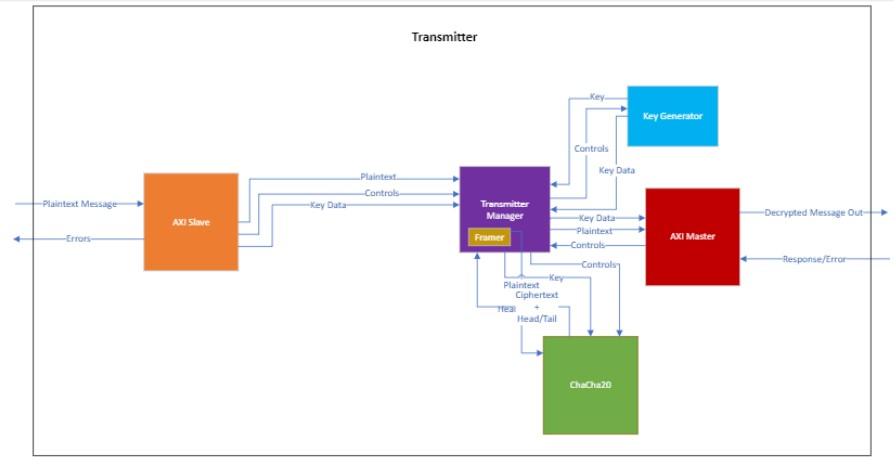
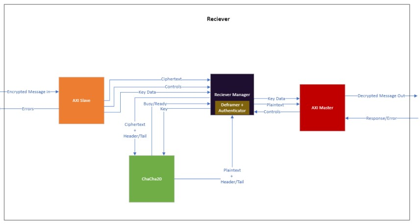
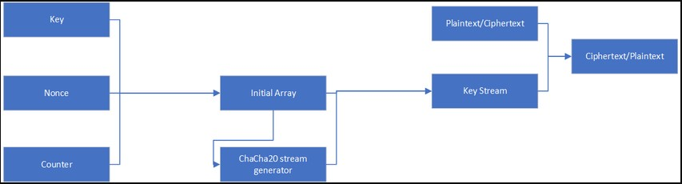
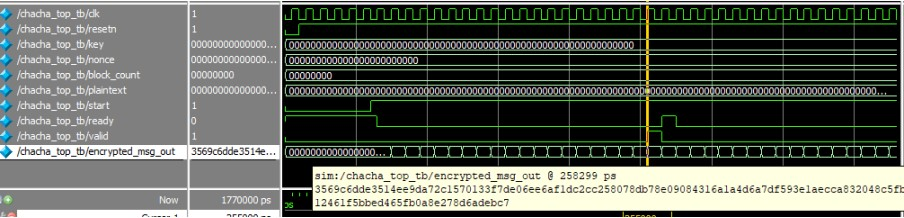
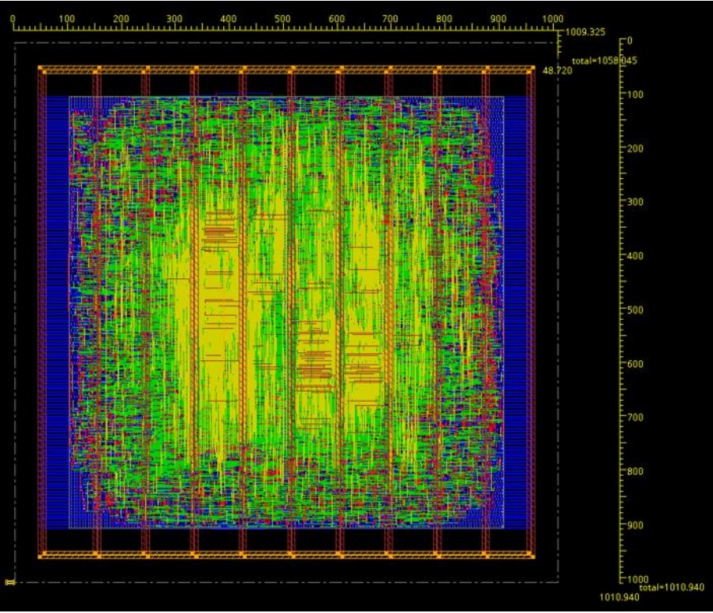

# Cyber Security Message Authentication

## Project Overview
This project implements a secure message authentication system that uses encryption to ensure confidentiality and integrity of communication between a transmitter and receiver. Utilizing the ChaCha20 encryption algorithm, the system supports authenticated messaging, protecting against interception, tampering, and unauthorized access. The project architecture is designed for seamless integration with the AXI Stream protocol, commonly used in industry, ensuring effective data exchange.

## Background
The goal of this project is to build a robust cyber security framework that securely transmits encrypted messages across public channels. This is achieved by designing two units—a transmitter and a receiver—that can exchange messages while verifying each message’s authenticity. Using ChaCha20 encryption and an authentication tag, the system prevents unauthorized entities from accessing message content, adding layers of protection such as message counters and timestamps to guard against replay attacks.

### Key Components of the Authentication System
1. **Message Counter**: Ensures messages are received in sequence, helping detect any missing messages.
2. **Timestamp**: Embeds time-based information within each message, preventing delayed or replayed messages.
3. **Secret Authentication Tag**: A shared secret tag between the transmitter and receiver to validate the message’s source and integrity.
4. **Message Type**: Indicates the type of message (e.g., regular, password update, reset), allowing the receiver to interpret the context.

## System Architecture
The system comprises two main units:
1. **Transmitter**
   - **Purpose**: Encrypts messages and prepares them for secure transmission to the receiver.
   - **Encryption Algorithm**: Uses the ChaCha20 algorithm, chosen for its efficiency, low memory usage, and strong security properties.
   - **Message Preparation**: Adds a timestamp, message counter, and an authentication tag to each message.
   - **AXI Stream Protocol**: Communicates with the main system via the AXI Stream protocol, ensuring compatibility with industry-standard communication interfaces.

2. **Receiver**
   - **Purpose**: Decrypts messages received from the transmitter and validates their authenticity.
   - **Decryption Process**: Utilizes the ChaCha20 algorithm to decrypt the message, followed by a verification step using the authentication tag.
   - **Authentication Check**: Ensures that the authentication tag and message counter are correct, validating the message’s authenticity.
   - **AXI Stream Protocol**: Receives encrypted data and passes decrypted messages back to the main system through the AXI Stream protocol.
      

## Encryption & Authentication with ChaCha20
ChaCha20 is a symmetric-key stream cipher designed for efficiency and security, making it suitable for both hardware and software implementations. Here’s how it functions in this system:
- **Key and Nonce**: Each message is encrypted with a 256-bit key and a 96-bit nonce, ensuring unique ciphertexts for identical messages.
- **Security Features**: ChaCha20’s bitwise operations, such as XOR and bit rotations, achieve high levels of diffusion and protect against common cryptographic attacks.
- **Efficiency**: ChaCha20’s minimal memory requirements and reduced complexity make it ideal for high-speed, resource-limited environments.

### Testing the Algorithm of the Encryption

## Project Workflow
The project workflow is divided into the following steps:

1. **Message Framing (Transmitter)**:
   - Prepares the message by embedding essential components: message counter, timestamp, and authentication tag.
   - Encrypts the message using ChaCha20.
   - Transmits the encrypted message through the AXI Stream protocol.

2. **Message Authentication and Decryption (Receiver)**:
   - Receives the encrypted message and decrypts it using ChaCha20.
   - Verifies the message’s authenticity by checking the message counter and authentication tag.
   - Sends the verified message to the main system for further processing.

3. **State Machine (Transmitter & Receiver)**:
   - The system’s operation is managed by a state machine that coordinates message encryption, decryption, and authentication based on the message type (e.g., regular, password update, reset).

## Project Components
- **AXI Stream Protocol**: Ensures compatibility and reliability in data exchange between transmitter, receiver, and main systems.
- **ChaCha20 Algorithm**: Encrypts messages with high efficiency and security, providing robust protection for transmitted data.
- **State Machines**: Manages different states in the message processing flow, such as initialization, encryption, decryption, and message verification.

## Future Work
This project could be expanded to support additional features:
- **Multiple Message Types**: Implement more message types for specific scenarios, like urgent messages or system alerts.
- **Enhanced Key Management**: Introduce dynamic key updates to further strengthen security.
- **Broader Protocol Support**: Add support for more communication protocols for increased system versatility.

## Conclusion
The Cyber Security Message Authentication project demonstrates an effective approach to secure communication over public channels. By using ChaCha20 encryption and the AXI Stream protocol, the system ensures both the authenticity and integrity of messages, contributing to a reliable cybersecurity framework.

---

**Note**: For detailed specifications, system diagrams, and simulations, refer to the final report document.
